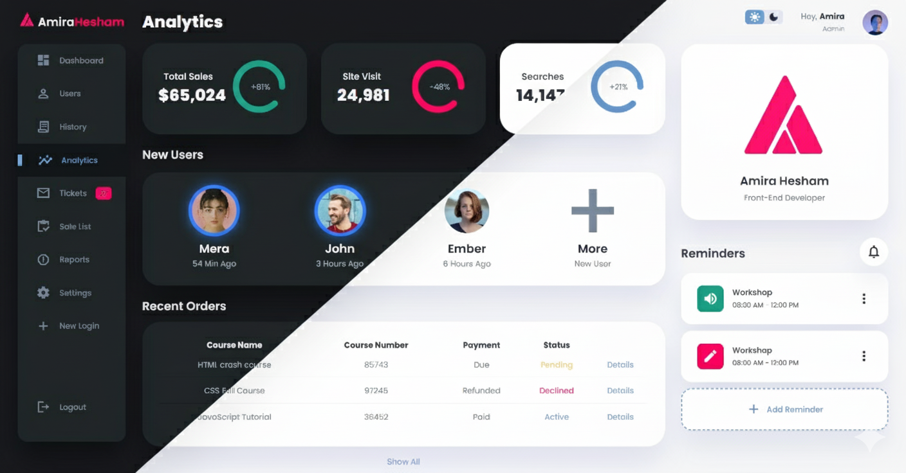

Modern Admin Dashboard
A fully responsive, interactive admin dashboard built with React and styled with Tailwind CSS. This project features dynamic data fetching, a persistent dark mode, and a mobile-first design optimized for all screen sizes.

► Screenshot

✨ Features
Fully Responsive Design: Adapts seamlessly to desktop, tablet, and mobile devices.

Component-Based Architecture: Built with reusable and maintainable React components.

Dark Mode: A functional light/dark mode toggle that saves the user's preference in their browser.

API Integration: Fetches and displays data from a mock API using React Query for efficient data caching and state management.

Dynamic Table: The "Recent Orders" table includes:

Live Search: Filter data in real-time.

Pagination: Easily navigate through large sets of data.

Mobile-First Enhancements:

A mobile-friendly card layout for the data table.

A compact, fixed header for easy navigation on small screens.

🛠️ Tech Stack
Vite: Next-generation frontend tooling for a fast development experience.

React: A JavaScript library for building user interfaces.

Tailwind CSS: A utility-first CSS framework for rapid, custom UI development.

React Query: For fetching, caching, and updating data in React applications.

Axios: A promise-based HTTP client for making API requests.

React Icons: A library for including popular icons in your project.

🚀 Getting Started
To get a local copy up and running, follow these simple steps.

Prerequisites
Node.js (version 14 or later)

npm (or yarn/pnpm)

Installation
Clone the repository:

Bash

git clone https://github.com/Amiirahesham/ReactAdminDashboard.git
Navigate to the project directory:

Bash

cd modern-dashboard
Install dependencies:

Bash

npm install
Place your images:

Make sure your image assets (e.g., myLogo.png, review-1.jpg) are located in the public/images/ directory.

Run the development server:

Bash

npm run dev
The application will be available at http://localhost:5175.

🔌 API Endpoints Used
This project uses a mock API for demonstration purposes, provided by JSONPlaceholder.

Fetch Orders Data:

GET https://jsonplaceholder.typicode.com/todos?_limit=50

This endpoint retrieves a list of "todo" items, which are then transformed and displayed as "Recent Orders" in the dashboard.

📝 Design Choices & Notes
Responsive Layout: The main layout was refactored from a simple grid to a more robust structure with a dedicated <Header /> component. This solved a major responsive issue where the header would appear in the middle of the page on mobile, ensuring a correct and intuitive layout on all devices.

Tailwind CSS Dark Mode: The project uses Tailwind's class strategy for dark mode, controlled by JavaScript. This allows the theme to be toggled manually and persisted in localStorage.

Table to Card Layout: On mobile screens, the traditional <table> for "Recent Orders" is replaced by a more readable card-based list. This is achieved using Tailwind's responsive utility classes (sm:hidden, hidden sm:block) to render the appropriate layout for the screen size.